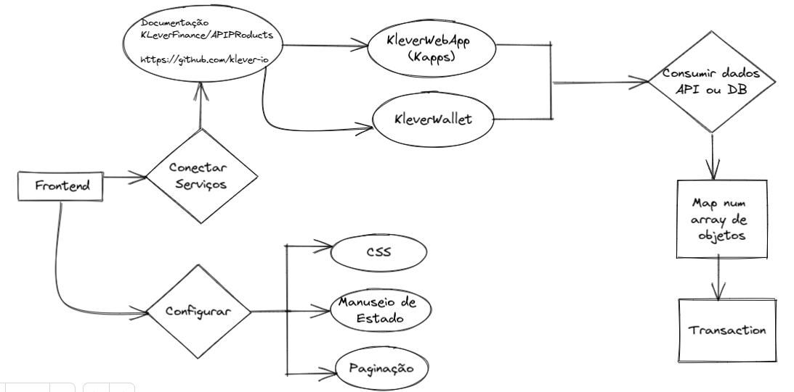

## E-Commerce com doação - Grupo 03

- # Equipe:
> Daniel Rubens - A<br>
> Laura Lana - A<br>
> Marcos Souza - B<br>
> Raynara Santiago - A<br>

- # Características do projeto:
> Next.js<br>
> Manuseio de estado: Context<br>
> Fruto do curso JS Mastery de Adrian Rajdin<br>
> Esquema criado para orientar ações e divisões de tarefas<br>


- # Evolução do projeto:
> Leitura em grupo da documentação Klever Finance e estudo sobre a empresa<br>
> Clone de repositórios do GitHub da Klever para especular possíveis abordagens do Hackaton<br>
> Estudo da tipagem da biblioteca @klever/sdk<br>
> Correlação do que havia sido estudado com o que foi mostrado no dia do fechamento com a Klever<br>

```bash
if (!window.kleverWeb) {
    return 'KleverWeb is not installed';
  }

  const address = await window.kleverWeb.initialize();

  return address;
```

- # Execução do projeto:
> Todos os membros com a extensão conectada e fazendo transação<br>
> Divisão em duplas - Laura e Marcos, Raynara e Daniel<br>
> Intervalos com pequenas reuniões para verificar o progresso<br>

- # Ponto positivo:
> Por termos nos antecipado cogitando possíveis eventos, diminuímos as dificuldades e enxergamos as soluções com eficiência<br>

- # Próximos passos:
> Integração da API de doação Polen<br>
> Adicionar testes<br>

- # Vídeo da aplicação funcionando:
https://user-images.githubusercontent.com/51061212/206909473-2e70f8d5-1bfb-4abf-86f5-216c1021cdbe.mp4

- # Link do deploy no Vercel:
> https://hackaton-t22-klever.vercel.app/
